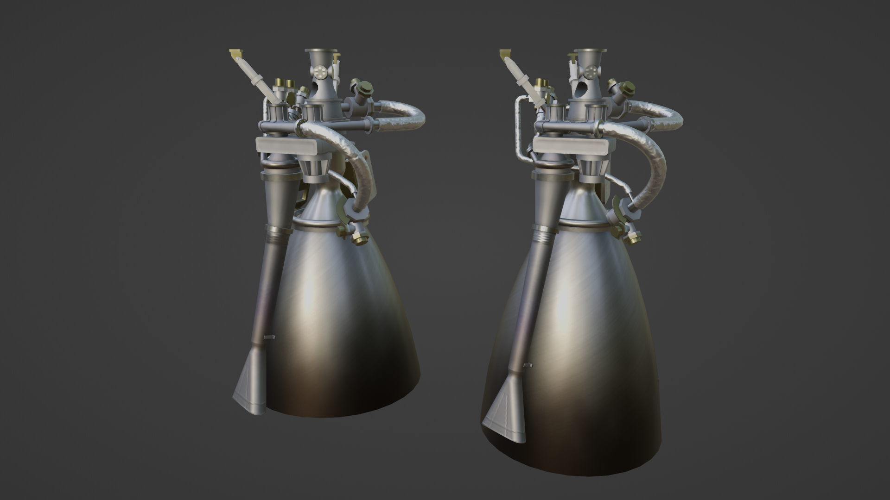

# Astral Manufactures

This repository contains the source files for a number of models of obscure rocket engines. The parts are shipped in the [ROEngines](https://github.com/KSP-RO/ROEngines) mod for KSP-RO.

## Parts included

### XLR11

### HM7

### G-1

## License

&copy; Alvin Meng.

This work is licensed under a [Creative Commons Attribution-NonCommercial-ShareAlike 4.0 International License](http://creativecommons.org/licenses/by-nc-sa/4.0/).
